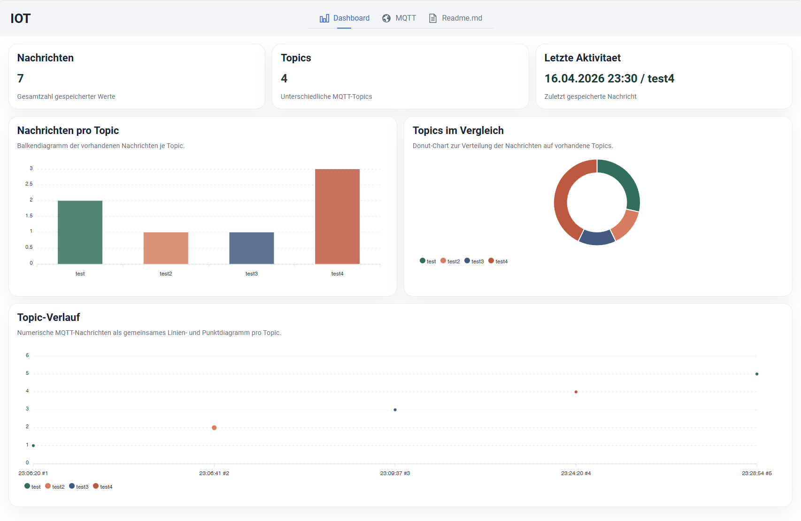

# IOT MQTT Demo



## Überblick

Dieses Projekt ist eine kleine, gut nachvollziehbare Webanwendung mit **Vaadin**, **Spring Boot**, **H2** und **MQTT**.  
Es dient als einfache **IoT-Demo** und wurde bewusst so aufgebaut, dass man den Code schnell lesen und verstehen kann.

## Funktionen

Die Anwendung kann:

- sich mit einem **MQTT-Broker** verbinden
- **MQTT-Nachrichten empfangen, speichern und senden**
- gespeicherte Daten in einem **Dashboard visualisieren**
- eine **integrierte Doku-Ansicht** direkt in der Anwendung anzeigen

## Einsatzmöglichkeiten

Das Projekt eignet sich gut als:

- **Lernprojekt** für Vaadin, Spring Boot und MQTT
- kleine **Demo** für Unterricht, Präsentation oder Abgabe
- **Ausgangspunkt** für eigene IoT-Anwendungen

## Warum das Projekt gut verständlich ist

Der Aufbau wurde bewusst einfach gehalten:

- klare Trennung von **UI, Services, Datenbank und MQTT**
- übersichtliche Paketstruktur
- einfache Standardkonfiguration
- **H2** als sofort nutzbare Standarddatenbank
- MQTT-Verbindung läuft unabhängig von einzelnen Views
- integrierte Dokumentation für einen schnellen Einstieg

## Hauptbereiche der Anwendung

### Dashboard

Das Dashboard zeigt eine kompakte Übersicht über die gespeicherten MQTT-Daten.
Dazu gehören unter anderem:

- Anzahl gespeicherter Nachrichten
- Anzahl vorhandener Topics
- letzte Aktivität
- Diagramme für Verteilungen und Verläufe

Für die Visualisierung wird **ApexCharts** verwendet.

### MQTT-Ansicht

In der MQTT-Ansicht kann man:

- eine Broker-Adresse eintragen
- sich mit einem Broker verbinden
- die Verbindung wieder trennen
- Nachrichten an ein Topic senden
- gespeicherte Werte im Grid ansehen

Wichtig: Eine aufgebaute Verbindung bleibt bestehen, auch wenn die View verlassen wird. Sie endet erst beim bewussten Trennen oder beim Schließen der Anwendung.

### Doku-Ansicht

Die Doku-Ansicht zeigt die wichtigsten Projektinformationen direkt in der Anwendung an. Sie dient als schnelle Übersicht für Personen, die das Projekt zum ersten Mal öffnen.

## Verwendete Technologien

- Java 17
- Spring Boot 3
- Vaadin 24
- Spring Data JPA
- H2-Datenbank
- Eclipse Paho MQTT Client
- ApexCharts
- Maven Wrapper

## Standardkonfiguration

Standardmäßig ist Folgendes konfiguriert:

- Server-Port: `8080`
- H2-Datenbank als Standarddatenbank
- MQTT-Broker: `tcp://127.0.0.1:1883`
- leere MQTT-Zugangsdaten

Wenn lokal ein MQTT-Broker unter `127.0.0.1:1883` läuft, kann das Projekt direkt verwendet werden.

## Projekt starten

Start im Entwicklungsmodus:

```bash
mvnw
```

Danach ist die Anwendung erreichbar unter:

```text
http://localhost:8080
```

Die H2-Konsole ist im Standardsetup ebenfalls aktiv:

```text
http://localhost:8080/h2-console
```

## Build prüfen

Wenn nur geprüft werden soll, ob das Projekt sauber kompiliert, genügt:

```bash
mvnw test
```

## Produktionsbuild erstellen

```bash
mvnw clean package -Pproduction
java -jar target/iot24-1.0-SNAPSHOT.jar
```

## Docker-Nutzung

### Docker-Image bauen

```bash
mvnw clean package -Pproduction
docker build . -t iot24:latest
```

### Docker-Container starten

```bash
docker run -p 8080:8080 iot24:latest
```

Danach ist die Anwendung ebenfalls unter `http://localhost:8080` erreichbar.

## Projektstruktur

### `src/main/java/de/feswiesbaden/iot/views`

Hier liegt der UI-Code, zum Beispiel für:

- Dashboard
- MQTT
- Dokumentation

### `src/main/java/de/feswiesbaden/iot/data/mqttclient`

Hier befinden sich Datenklassen, Repository und Services für gespeicherte MQTT-Werte.

Wichtige Bestandteile sind:

- `MqttValue`
- `MqttValueRepository`
- `MqttValueService`
- `MqttConnectionService`

### `src/main/java/de/feswiesbaden/iot/mqttconnector`

Hier liegt die technische MQTT-Anbindung, also:

- Verbindungsaufbau
- Publish
- Subscribe
- Callback-Verarbeitung

### `src/main/resources`

Hier liegen unter anderem:

- `application.properties`
- statische Ressourcen
- weitere Konfigurationsdateien

## Architektur in einfacher Form

Die Anwendung trennt Frontend und Backend nicht in zwei separate Projekte, sondern nutzt **Vaadin**. Dadurch wird die UI in Java entwickelt und als Webanwendung im Browser dargestellt.

Die Struktur lässt sich einfach merken:

- **Views**: Anzeige und Eingaben
- **Services**: Programmlogik
- **Repository**: Datenzugriff
- **MQTT-Connector**: Kommunikation mit dem Broker

## Datenbank

Standardmäßig wird **H2** verwendet. Das ist für diese Demo sinnvoll, weil:

- keine externe Datenbank eingerichtet werden muss
- das Projekt schnell startbar bleibt
- das Beispiel einfach und verständlich bleibt

Ein Wechsel auf **MariaDB** ist möglich, erfordert aber Anpassungen in `pom.xml` und `application.properties`.

## Hinweise für Erweiterungen

Wenn das Projekt erweitert werden soll, sind diese Punkte sinnvoll:

- neue UI-Funktionen zuerst in einer View oder kleinen Komponentenklasse kapseln
- MQTT-spezifische Logik nicht direkt in die Views schreiben
- Datenbankzugriffe über Repository und Service führen
- Konfiguration zentral in `application.properties` halten

## Fazit

Dieses Projekt ist eine **kleine, schlanke und gut lesbare IoT-Demo**, die nicht nur funktioniert, sondern auch leicht verständlich aufgebaut ist. Es eignet sich besonders gut, um die Zusammenarbeit von **Vaadin, Spring Boot, Datenbank und MQTT** praktisch zu zeigen.
